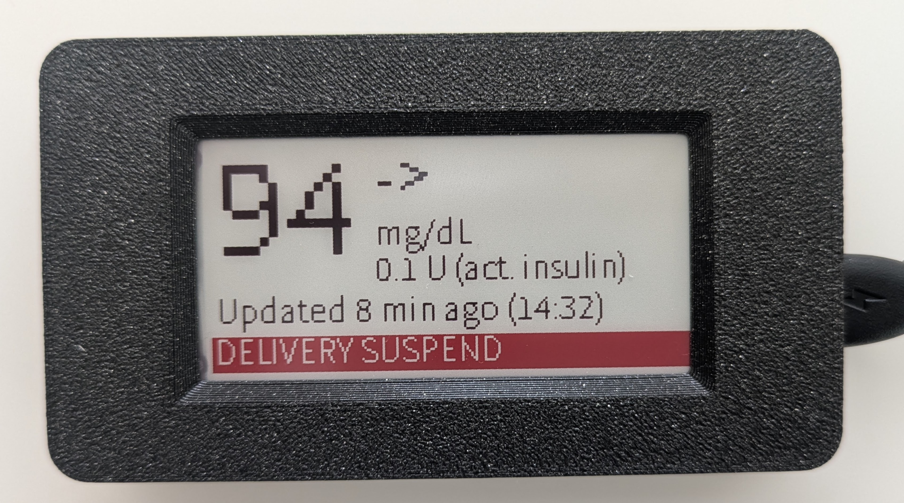
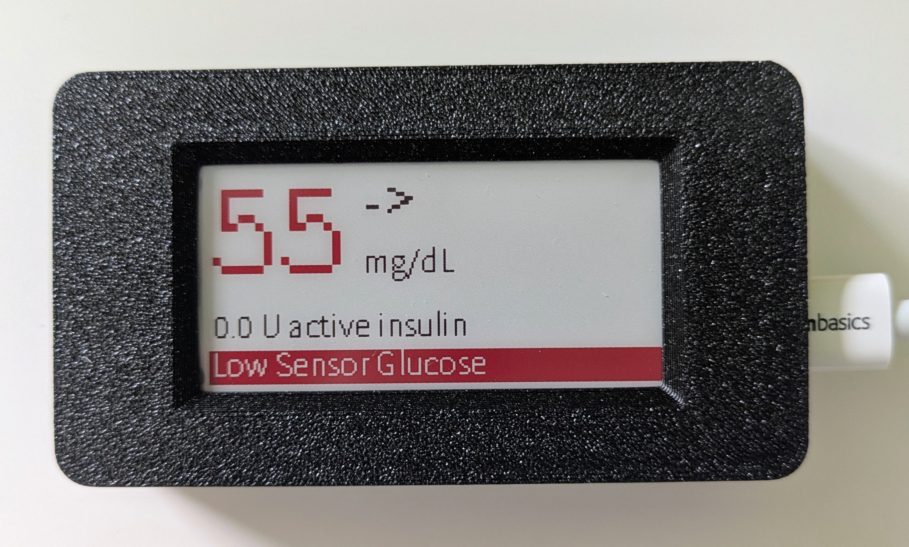
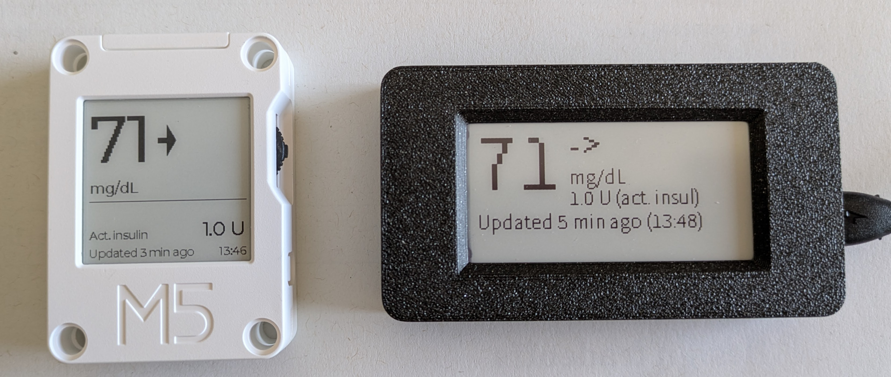

# Inkplate Minimed Monitor

A remote monitor for the Medtronic Minimed 770G/780G insulin pump system, built for caregivers of a Type-1 Diabetes patient wearing the pump. It runs on a [Soldered Inkplate 2](https://soldered.com/product/inkplate-2/) (a 2.13" 3-color e-paper board built around a classic ESP32) and wakes roughly every 5 minutes to poll pump status, redraw the display, and go back to deep sleep — giving a low-power, always-legible glucose/insulin display without needing to be plugged into a full-size screen.


## What it shows

A single always-current view: current glucose reading (colored red when out of a configurable target range), trend direction, active insulin on board, and either a "last updated" timestamp or an active pump alarm banner.

 

## Hardware

- [Soldered Inkplate 2](https://soldered.com/product/inkplate-2/) (2.13", 212×104px, black/white/red e-paper, classic ESP32)
- A WiFi network the device can reach
- A running instance of a **Carelink proxy** — this monitor doesn't talk to Medtronic's Carelink Cloud directly. It polls a REST API in front of it. The [Carelink Python Client](https://github.com/ondrej1024/carelink-python-client) project is one way to run such a proxy.

## Setup

1. Flash [Inkplate-micropython](https://github.com/SolderedElectronics/Inkplate-micropython) firmware:
   ```
   esptool.py --chip esp32 --port /dev/ttyUSB0 erase-flash
   esptool.py --chip esp32 --port /dev/ttyUSB0 write-flash -z 0x1000 inkplate-firmware.bin
   ```
2. Install the board driver package:
   ```
   mpremote mip install github:SolderedElectronics/Inkplate-micropython/boards/inkplate2
   ```
3. Copy this repo's `main.py` to the device so it runs on every boot:
   ```
   mpremote cp main.py :main.py
   ```
4. Power/reset the device. On first boot (or any time it can't find valid WiFi credentials), it starts an access point named `INKPLATE_MINIMED_MON` (password `123456789`) with a config page at `http://192.168.4.1` — connect to that network from a phone or laptop and fill in your WiFi credentials, NTP server, timezone, and Carelink proxy address/port. The device reboots and starts polling once configured.

Config is persisted as JSON at `/minimed_config.json` on the device. To reset it, delete that file via `mpremote` and reboot.

> **Power it from a proper USB adapter, not a PC port.** A marginal supply can't source the WiFi radio's power-up inrush, and the board resets the instant the radio comes on. It looks like a software hang — the panel sits on the version splash and updates stop — but it's a reset loop that can never clear itself, because the device never reaches deep sleep and so cold-boots into the same failure every time. Flashing works fine on a weak port, since that draws almost nothing.

## Notes on this design

- **No partial e-paper refresh** — every redraw is a full-panel flash/settle cycle (~17–23 seconds). This is a hardware/driver limitation of this board, not a bug.
- **Deep sleep between cycles** — the whole script re-runs from scratch on every wake; there's no in-memory state carried between polls. This keeps average power draw low, since CGM readings only update roughly every 5 minutes upstream regardless of how often you poll.
- **Visual-only alarms** — this board has no speaker, so pump alarms show as an on-screen banner only. A caregiver not looking at the display won't get an audible alert. This is a real, accepted limitation of using an e-paper board for this purpose, not an oversight. (The Core Ink port below resolves this — it has a buzzer.)

See the comments at the top of `main.py` for further hardware/firmware quirks this design works around.

## M5Stack Core Ink port

`main_m5coreink.py` is a sibling port to the [M5Stack Core Ink](https://docs.m5stack.com/en/core/coreink) — 1.54" 200×200 monochrome e-paper, ESP32-PICO-D4 — running the UIFlow2 MicroPython firmware. It exists mainly because that board **has a buzzer**, so an active pump alarm gets an audible beep (one per update cycle, repeating while the alarm stands) rather than a banner nobody may be looking at.



The two boards running the same monitor, minutes apart — the Core Ink on the left, the Inkplate 2 on the right.


It also has a switch, so it carries three screens instead of one, cycled endlessly by flicking it either way:

1. **Main** — glucose and trend arrows, active insulin, update time. The reading is drawn large when all is well and shrinks only when an alarm needs the bottom strip, where it appears in reverse video alongside the beep. Having no red ink, an out-of-range reading inverts the glucose band instead of colouring it.
2. **Glucose, last 24 h** — time in target / above / below, and average SG, over a stacked bar.
3. **Device & network** — battery, Wi-Fi, IP, proxy, NTP, timezone.

Pressing the switch redraws from a cached snapshot without touching the network, so screens change immediately rather than waiting on Wi-Fi.

> **On battery, the button on the back switches the board off, not on.** It is a
> bare reset line: it holds the ESP32 in reset, and a chip in reset cannot drive
> the pin that latches the power rail on — so the board switches off, and that
> same button has no way to switch it back on. Because e-paper keeps its last
> image with no power at all, it then looks frozen rather than off. Hold the
> **PWR button** to switch it back on, or plug in USB.
> (Crashes and watchdog resets *do* recover by themselves — see
> [PORTING-M5COREINK.md](PORTING-M5COREINK.md) for the firmware patch that
> makes that work.)

Setup differs enough from the Inkplate (different firmware, a required NVS setting, and the app must be deployed **precompiled** or it runs the board out of memory) that it has its own document: **[PORTING-M5COREINK.md](PORTING-M5COREINK.md)**.

## How it works

[`docs/internals.html`](docs/internals.html) is a full visual walkthrough of the whole pipeline — pump and CGM sensor, Medtronic Carelink Cloud, the self-hosted proxy, and this device's own wake/fetch/draw/sleep cycle — with flowcharts for the alarm-decision logic and first-time setup, an annotated mock of the panel layout, and a complete reference of the Python code and library calls. Open it directly in a browser (it renders standalone, including its diagrams), or read [`docs/internals.pdf`](docs/internals.pdf) for the same document as a PDF.

## Credits

This project builds on and was originally inspired by [Ondrej Wisniewski](https://github.com/ondrej1024)'s **M5 Minimed Monitor**, an M5Stack-based version of the same idea — notably the fault-code lookup tables in `main.py`, which were reverse-engineered from real Carelink pump alarm data, and the overall data-polling/config/AP-setup design this project builds on. The e-paper display this runs on has different enough constraints that the GUI, timing, and alarm-handling code here is a fresh design rather than a port.

## License

GPLv3 — see [LICENSE](LICENSE).
